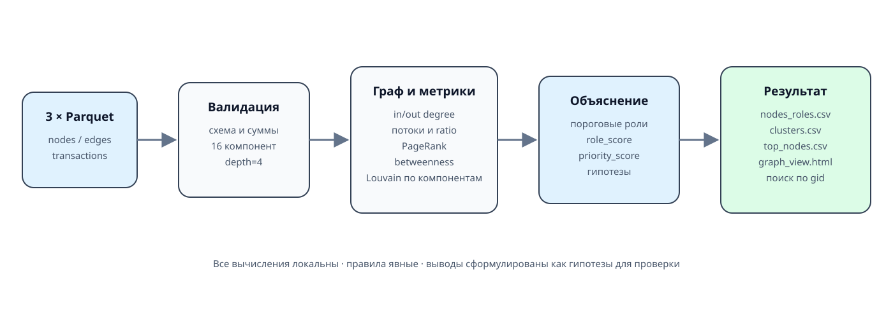

# hack-30cf4f13-iintenational
Hackathon team repository for IIntenational

## Граф денежных потоков: объяснимый приоритет проверки

Локальный пайплайн превращает три parquet-файла в роли всех узлов, Louvain-кластеры,
ранжированный список для аналитика и интерактивную схему. Результаты являются
**гипотезами для проверки**, а не выводами о виновности.

> Важно: оригинальный датасет отсутствовал в рабочей папке. Текущие parquet и
> выгрузки созданы детерминированным синтетическим генератором по публичным
> контрольным числам `AGENT.md`. Они демонстрируют реализацию, но не являются
> результатом анализа оригинальных данных HackAlem. Подробности — в
> [`data/README.md`](data/README.md).



## Что запускать

| Задача | Команда после однократной установки | Где смотреть результат |
|---|---|---|
| Загрузить свои файлы через интерфейс, настроить поля, выполнить анализ | `powershell -NoProfile -ExecutionPolicy Bypass -File .\run_app.ps1` | Браузер: `http://127.0.0.1:8765/` |
| Пересчитать три `data/*.parquet` по строгому заданию HackAlem одной командой | `powershell -NoProfile -ExecutionPolicy Bypass -File .\run.ps1` | Каталог `outputs/`, файл `graph_view.html` |

Для знакомства с системой начните с **локального приложения**. Сервер и
аналитика работают на вашем компьютере. Сам репозиторий GitHub не запускает
Python, а просмотр `index.html` на GitHub не заменяет запуск приложения.

## Запуск с нуля: Windows PowerShell

### 1. Подготовьте окружение

Нужны:

- Python 3.12+ **кроме 3.14.1** — её исключает установленная версия NetworkX.
  Проверенное окружение проекта: Windows, Python 3.14.6.
- Git для клонирования либо скачанный ZIP репозитория.
- Современный браузер; автоматические проверки выполнены в Chrome.
- Интернет для скачивания проекта и первоначальной установки зависимостей.
  После установки обработка и просмотр работают без интернета.

GPU, Docker, база данных, API-ключи, платные сервисы, Node.js и npm для обычного
запуска **не нужны**. Node.js используется только в дополнительных тестах UI.

Откройте PowerShell и проверьте доступность команд:

```powershell
python --version
git --version
```

Если `python` не найден, но установлен Windows Python Launcher, проверьте
`py --version`. При подходящей версии окружение можно создать командой
`py -m venv .venv`. Если Python или Git не установлены, сначала установите их
и откройте новый терминал; Git не обязателен при скачивании ZIP.

### 2. Скачайте проект и перейдите в его корень

Из папки, в которой хотите сохранить проект:

```powershell
git clone https://github.com/BAITC-Hacks/hack-30cf4f13-iintenational.git
cd hack-30cf4f13-iintenational
```

Альтернатива: на GitHub выберите **Code → Download ZIP**, распакуйте архив и
откройте PowerShell в распакованной папке. Не запускайте проект прямо из ZIP.

В текущей папке должны находиться `README.md`, `requirements.txt`, `run_app.py`
и `run_app.ps1`. Все команды ниже рассчитаны на этот корень репозитория.

### 3. Один раз установите зависимости

```powershell
python -m venv .venv
.\.venv\Scripts\python.exe -m pip install -r requirements.txt
.\.venv\Scripts\python.exe -m pip check
```

Дождитесь завершения установки без ошибок. Последняя команда должна сообщить
`No broken requirements found.`. Если использовали `py`, замените только первую
команду на `py -m venv .venv`.

Активировать окружение через `Activate.ps1` не требуется: все команды явно
используют Python из `.venv`. Эта папка не хранится в GitHub — после клонирования
на новом компьютере её нужно создать заново.

### 4. Запустите приложение одной командой

```powershell
powershell -NoProfile -ExecutionPolicy Bypass -File .\run_app.ps1
```

Ожидаемая строка в терминале:

```text
Потоки — локальный мастер импорта: http://127.0.0.1:8765
```

Откройте [http://127.0.0.1:8765/](http://127.0.0.1:8765/) в браузере. Должны
появиться заголовок «От таблицы к картине потоков», кнопка «Новый анализ» и
четыре шага: «Файлы», «Поля и условия», «Проверка», «Результат».
Браузер автоматически не открывается.

**Оставляйте терминал открытым:** он обслуживает приложение. Остановка —
`Ctrl+C` в этом терминале. Закрытие вкладки браузера сервер не останавливает;
для повторного запуска используйте ту же команду. Готовые расчёты останутся
в истории при использовании того же каталога данных.

`ExecutionPolicy Bypass` применяется только к этому процессу PowerShell,
а не меняет системную политику. Если предпочитаете запуск без `.ps1`:

```powershell
.\.venv\Scripts\python.exe -X utf8 run_app.py
```

Сервер слушает только `127.0.0.1`: адрес доступен на этом же компьютере.
Не публикуйте его через туннель, reverse proxy или общий хостинг.

### 5. Выполните первый анализ на готовом примере

Для проверки не нужны собственные финансовые файлы:

1. На шаге «Файлы» выберите
   [`examples/workbench/transactions.csv`](examples/workbench/transactions.csv)
   из **локальной** копии репозитория. Тип таблицы — «Переводы».
2. Нажмите «Настроить поля». Проверьте: отправитель → `src`, получатель →
   `dst`, сумма → `amount`, дата → `date`. «Валюта в строке» остаётся незаданной:
   в этом примере такой колонки нет.
3. В условиях анализа оставьте профиль **«Пользовательский набор»**, укажите
   валюту **USD**, знаков после запятой **2**, полноту наблюдений
   **«Неизвестна»**. Размер приоритетного списка можно оставить 30.
4. Нажмите «Проверить данные». Ожидайте **3 узла, 2 связи, 2 перевода,
   1 компоненту и оборот 1250.25 USD**. Отсутствие seed и глубины — объяснённое
   ограничение примера, не ошибка импорта.
5. Нажмите «Запустить анализ». После статуса «Готово» появятся граф и кнопки
   скачивания. Найдите GID `001`: ведущие нули должны сохраниться.
6. Откройте таблицу связей и карточку узла, скачайте CSV. Перезагрузите вкладку
   и откройте тот же результат в истории.

Можно добавить ещё `examples/workbench/nodes.json` и `edges.csv`, назначив им
типы «Узлы» и «Агрегированные связи»: получится **4 узла и 2 компоненты**,
включая изолированный `ISOLATED`. Этот маленький пример не подходит для строгого
профиля HackAlem — тот намеренно остановит расчёт при несовпадении с ТЗ.

### 6. Загрузите свой набор

Мастер принимает **CSV, TSV, XLSX, JSON, JSONL и Parquet**. Допустим один файл
переводов либо отдельные таблицы узлов, связей и транзакций, не более одной
каждого типа. Для переводов обязательны отправитель, получатель и сумма;
названия колонок сопоставляются вручную. Для Excel выбирается лист, для CSV —
разделитель и кодировка.

Суммы должны быть в основных единицах выбранной валюты: `12.50` означает
12,50 USD при точности 2, а не 1250 USD. Один расчёт — одна валюта, без
конвертации. Неизвестные seed/depth не выдумываются. Если полнота неизвестна,
правила транзита и удержания, требующие этого контекста, не применяются.

Пределы первой версии: **20 МиБ на файл**, 100 000 строк на таблицу,
10 000 узлов и 50 000 направленных связей; один расчёт одновременно.
Лимит приёма не является гарантией времени для любой топологии.

Полная схема, особенности форматов и ограничений — в
[руководстве мастера](docs/workbench.md). Не загружайте ФИО, ИИН и другие
личные атрибуты: подготовьте только нужные обезличенные поля.

## Где находятся данные и результаты

Приложение **не скачивает транзакции из интернета**, не подключено к банковским
системам и не добавляет сведения о клиентах из внешних источников.

| Источник | Что это и когда используется |
|---|---|
| `data/*.parquet` | Синтетический демонабор, созданный `scripts/generate_demo_data.py` по схеме и контрольным агрегатам `AGENT.md`. Его читает `run.ps1`; это не оригинальная выгрузка организаторов |
| `examples/workbench/` | Маленькие вымышленные таблицы для первого ручного импорта |
| Файлы, выбранные пользователем | Фактический вход мастера. Он не подставляет демонабор автоматически; выводы зависят от загруженных данных и выбранных условий |

Оригинального датасета HackAlem в исходной рабочей папке не было. Синтетика
проверяет работоспособность, но не доказывает качество выявления ролей на
реальных данных. Известное противоречие контрольных условий и маркировка
демонабора описаны в [`data/README.md`](data/README.md).

По умолчанию локальное приложение создаёт:

```text
workbench_data/
  uploads/                  копии выбранных файлов под серверными ID
  uploads.json              индекс загрузок
  runs/<run_id>/
    state.json              состояние отдельного расчёта
    artifacts/
      nodes_roles.csv
      clusters.csv
      top_nodes.csv
      graph_view.html
      report.json
      result.json
```

У каждого запуска своя папка; новый анализ не перезаписывает предыдущий.
Скачивания браузера сохраняются в выбранную браузером папку, а серверные копии
остаются здесь. `workbench_data/` исключён из Git, но **не зашифрован**.
Не переносите реальные загрузки в отслеживаемые `data/`, `outputs/` или публичные
коммиты. Удаление файла из текущего набора мастера не удаляет его копию на диске.
Очистка выполняется при остановленном сервере по [инструкции](docs/workbench.md#хранение-и-очистка).

### Другой порт или отдельная история

После остановки прежнего процесса, если нужно сменить порт:

```powershell
powershell -NoProfile -ExecutionPolicy Bypass -File .\run_app.ps1 -Port 8766
```

Откройте адрес, который напечатает терминал: `http://127.0.0.1:8766/`.
Для отдельного хранилища, например вне репозитория:

```powershell
powershell -NoProfile -ExecutionPolicy Bypass -File .\run_app.ps1 -Port 8766 -DataDir "$env:LOCALAPPDATA\Potoki"
```

Смена `-DataDir` показывает другую историю, а не переносит старую. Один и тот
же каталог нельзя одновременно открыть двумя серверами, даже на разных портах.
Для произвольного каталога самостоятельно обеспечьте права доступа и защиту
от публикации/синхронизации. Справка: `.\.venv\Scripts\python.exe run_app.py --help`.

## Строгий пайплайн HackAlem: одна команда

После той же установки зависимостей полный пересчёт **от трёх сырых Parquet
до трёх CSV и экрана**, без ручных действий между стадиями:

```powershell
powershell -NoProfile -ExecutionPolicy Bypass -File .\run.ps1
```

Либо без обёртки PowerShell:

```powershell
.\.venv\Scripts\python.exe -X utf8 run_pipeline.py
```

Этот режим не запускает веб-сервер: он читает `data/nodes.parquet`,
`edges.parquet`, `transactions.parquet` и обновляет результаты в `outputs/`.
Откройте **локальный** `outputs/graph_view.html` двойным щелчком в проводнике:
он автономен и работает без сервера. Ссылка на HTML на GitHub показывает файл
репозитория, а не живое приложение.

Ожидаемые контрольные числа: 2248 узлов, 3119 связей, 4840 транзакций,
16 компонент; создаются три CSV, HTML и `run_report.json`.
Пятиминутное требование относится к этому объёму, не к установке зависимостей.
Если контрольные значения не сходятся, расчёт останавливается, данные не
подгоняются. Произвольный набор анализируйте через пользовательский профиль.

Демонстрационные Parquet уже входят в репозиторий. Команда
`.\.venv\Scripts\python.exe scripts\generate_demo_data.py` нужна только для
их восстановления и **перезаписывает** три файла `data/` и demo manifest.
Не выполняйте её поверх своих данных. Она не является частью анализа и не
заменяет получение оригинального датасета.

## macOS и Linux

Прямые Python-команды не требуют PowerShell. После клонирования перейдите в
корень и проверьте `python3 --version`: нужны те же версии, что указаны выше.

```bash
python3 -m venv .venv
./.venv/bin/python -m pip install -r requirements.txt
./.venv/bin/python -m pip check
./.venv/bin/python -X utf8 run_app.py
```

Откройте напечатанный локальный URL, оставьте терминал открытым; остановка —
`Ctrl+C`. Для строгого пересчёта отдельно выполните
`./.venv/bin/python -X utf8 run_pipeline.py`.
Это эквивалентный способ запуска; полный регрессионный прогон проекта пока
выполнен **на Windows**, а не на macOS/Linux.

## Если не запускается

| Симптом | Что проверить |
|---|---|
| `python`/`git` не найден | Установка и доступность в PATH; откройте новый PowerShell. Для Python можно использовать подходящий `py`, для проекта — ZIP вместо Git |
| Скрипт просит установить зависимости / нет `.venv` | Перейдите в корень репозитория и выполните шаг 3. Виртуальное окружение с другого компьютера копировать не нужно |
| `ModuleNotFoundError`, например `openpyxl` | Выполните `.\.venv\Scripts\python.exe -m pip install -r requirements.txt`, затем `pip check` тем же Python; системный `pip` может относиться к другому окружению |
| Ошибка совместимости при установке | Проверьте `.\.venv\Scripts\python.exe --version`; Python 3.14.1 не подходит. Установите поддерживаемый интерпретатор и создайте для него окружение, не меняя закреплённые зависимости наугад |
| PowerShell блокирует `.ps1` | Используйте приведённую команду с `-ExecutionPolicy Bypass` либо прямой запуск `.venv\Scripts\python.exe -X utf8 run_app.py`; менять политику всей системы не требуется |
| Порт занят / `WinError 10048` | Возможно, приложение уже работает: откройте его адрес. Иначе остановите свой прежний процесс через `Ctrl+C` или используйте свободный порт; не завершайте неизвестные процессы |
| «Хранилище уже открыто другим экземпляром» | Остановите предыдущий сервер либо выберите другой `-DataDir`; смены одного порта недостаточно. Не удаляйте файлы блокировки у работающего процесса |
| Страница не открывается | Посмотрите ошибку в терминале, используйте именно `http://127.0.0.1:<напечатанный порт>/`, не HTTPS, не адрес GitHub и не URL с другого компьютера |
| Ошибка сессии / 403 после перезапуска | Перезагрузите вкладку по адресу сервера: токен меняется при рестарте. Завершённые расчёты останутся в истории |
| Ошибка суммы или колонок | Проверьте тип таблицы, mapping, валюту, десятичную точность, кодировку/разделитель. После изменения настроек чтения нажмите «Применить и перечитать» |
| «Лимит хранилища загрузок исчерпан» | Квота исходных копий — 200 МиБ. Остановите сервер, сохраните нужные результаты и следуйте инструкции очистки; перезагрузка вкладки место не освобождает |

Состояние уже запущенного сервера можно проверить **из второго** PowerShell:

```powershell
(Invoke-WebRequest -Uri 'http://127.0.0.1:8765/' -UseBasicParsing).StatusCode
```

Ожидается `200`. Это подтверждает доступность страницы, а не корректность
аналитики; для проверки расчёта используйте пример выше и раздел «Тесты».

### Обновление установленного проекта

Остановите приложение. Если копия получена через Git:

```powershell
git status
git pull --ff-only
.\.venv\Scripts\python.exe -m pip install -r requirements.txt
powershell -NoProfile -ExecutionPolicy Bypass -File .\run_app.ps1
```

При локальных изменениях или конфликте не используйте принудительный reset:
сначала сохраните свою работу и разберите сообщение Git. `workbench_data/`
не синхронизируется с GitHub; резервные копии локальных результатов нужны отдельно.

Проверенные возможности и границы тестирования — в
[протоколе мастера](docs/workbench-verification.md). Следующие разделы описывают
строгий пайплайн HackAlem; отличия пользовательского режима — в
[руководстве мастера](docs/workbench.md).

## Вход и проверка целостности

Схема полей описана в [`data/README.md`](data/README.md). Пайплайн останавливается,
если не совпадают обязательные колонки, число строк, ссылки рёбер на узлы,
агрегация транзакций, контрольный оборот или структура компонент.

Текущий демонстрационный набор:

| Проверка | Значение |
|---|---:|
| Узлы / рёбра / транзакции | 2 248 / 3 119 / 4 840 |
| Seed | 81 |
| Общий оборот | 365 890 012 KZT |
| Depth 0 / 1 / 2 / 3 / 4 | 81 / 472 / 462 / 789 / 444 |
| Слабосвязные компоненты | 16 |
| Размеры двух крупнейших | 1 877 / 270 |
| Seed без исходящих | 31 |

Строго проверяются контрольные объёмы и схема, уникальность узлов и пар рёбер,
ссылки всех концов рёбер и транзакций на существующие gid, соответствие
`edges.depth` глубине получателя, агрегация транзакций, минимальная сумма, даты
июля 2026 года, точное распределение по глубинам и размеры 16 слабосвязных
компонент. Для двух крупнейших проверяются размеры 1 877 и 270, для остальных —
диапазон 2–17 из ТЗ. Проверяется также отсутствие исходящих у depth=4.

## Метрики

Для каждого узла считаются `in_degree`, `out_degree`, уникальные плательщики и
получатели, `sum_in`, `sum_out`, `sum_out / sum_in`, наблюдаемое удержание,
компонента, PageRank и приближённая betweenness. Для компонент больше 300 узлов
betweenness использует детерминированную выборку из 128 источников. PageRank,
betweenness и оборот дополнительно переводятся в процентиль внутри компоненты,
чтобы малая компонента не сравнивалась напрямую с крупнейшей.

Баланс не трактуется как полный баланс клиента: граф содержит только наблюдаемую
часть исходящих переводов от исходной выборки.

## Правила ролей и пороги

Правила применяются сверху вниз. Первое сработавшее правило задаёт роль.

| Порядок | Роль | Формальное правило |
|---:|---|---|
| 1 | `coordinator` | `in_degree ≥ 2`, `out_degree ≥ 2`, максимум компонентных процентилей PageRank/betweenness `≥ 0.95`, компонентный процентиль оборота `≥ 0.75` |
| 2 | `distributor` | `out_degree ≥ 10` уникальных получателей |
| 3 | `consolidator` | `in_degree ≥ 8` уникальных плательщиков |
| 4 | `transit` | `depth < 4`, есть вход и выход, `0.8 ≤ sum_out/sum_in ≤ 1.2` |
| 5 | `terminal` | не seed, `depth < 4`, `in_degree ≥ 1`, наблюдаемое удержание `(sum_in − sum_out)+ / sum_in ≥ 0.8`, и `out_degree = 0` либо `sum_out/sum_in ≤ 0.2` |
| 6 | `peripheral` | ни одно правило выше не выполнено; сюда явно попадает обрезанная граница `depth=4, out=0` |

`role_score` также детерминирован. Для coordinator это 50% компонентной
центральности, 25% силы суммарной степени и 25% компонентного процентиля оборота.
Для distributor и consolidator уверенность линейно растёт от порога до 60
получателей или 24 плательщиков. Для transit она растёт при приближении ratio к
1.0. Для terminal учитываются наблюдаемое удержание и компонентный процентиль
оборота. Ratio seed не используется в транзитном правиле из-за неполного
входящего потока. `evidence` содержит сработавший порог и фактические метрики.

### Артефакт четвёртого колена

Все 444 узла `depth=4` имеют нулевой `out_degree` из-за границы обхода. Правило
terminal прямо запрещено для `depth=4`; такие узлы получают peripheral с явным
объяснением границы. Это не интерпретируется как «деньги остались на счёте».

## Кластеризация

Сначала находятся слабосвязные компоненты. Louvain запускается **отдельно в
каждой из 16 компонент** на неориентированной проекции; вес для кластеризации —
`log(1 + sum_kzt)`, чтобы один крупный перевод не подавлял структуру связей.
Порядок компонент и кластеров детерминирован, seed алгоритма равен 42.

`clusters.csv` содержит размер, число seed, сумму только внутренних рёбер,
структурно заметные gid и осторожную гипотезу. На демонстрационных данных найдено
89 кластеров, 21 из них содержит больше одного seed.

## Приоритет проверки

Формула не обучается и одинакова для всех узлов:

```text
priority_score = 0.45 × base(role)
               + 0.25 × role_score
               + 0.20 × max(component_pct(PageRank), component_pct(betweenness))
               + 0.10 × global_pct(turnover)
```

Базовые веса ролей: coordinator 1.00, consolidator 0.82, distributor 0.78,
transit 0.62, terminal 0.48, peripheral 0.18. Для `depth=4, out=0` итог
умножается на 0.85, чтобы граница обхода не давала ложный приоритет.

`top_nodes.csv` содержит 30 строк. Поле `why` объясняет позицию силой правила,
центральностью внутри своей компоненты и глобальным процентилем оборота.

## Результаты

После запуска каталог `outputs/` содержит:

- `nodes_roles.csv` — 2 248 узлов, обязательные поля `gid, role, role_score,
  cluster_id, priority_score, evidence`;
- `clusters.csv` — одна строка на каждый кластер;
- `top_nodes.csv` — 30 приоритетных узлов;
- `graph_view.html` — автономный интерфейс «Потоки» (SVG + Canvas);
- `run_report.json` — контрольные числа и время стадий.

Откройте [`outputs/graph_view.html`](outputs/graph_view.html) в браузере — сервер
не нужен. Интерфейс работает без сети, внешних шрифтов и JavaScript-библиотек.

### Как пользоваться интерфейсом

1. Начните с **очереди проверки**: все узлы упорядочены так же, как топ-лист,
   по приоритету, затем силе правила и gid. Баллы в интерфейсе показаны из 100;
   в CSV остаётся исходная шкала 0–1. Это не вероятности нарушения.
2. Выберите узел или введите точный `gid`. Карточка показывает роль, суммы,
   число контрагентов, раскрываемые объяснения правила и приоритета.
3. На схеме — крупнейшие входящие и исходящие связи: до 12 каждого направления,
   на узком экране до четырёх. Подпись сообщает, сколько показано из общего
   числа. На телефоне схема вертикальная: деньги движутся сверху вниз.
4. **Таблица связей** содержит всех соседей, точные суммы и число переводов,
   без усечения. Клик по соседнему gid открывает его карточку.
5. Фильтры роли, компоненты и кластера ограничивают очередь и режим **«Вся сеть»**.
   Схема/таблица выбранного узла всегда показывает его полный контекст,
   включая соседей вне фильтров. Глобальный поиск сбрасывает несовместимые
   фильтры и сообщает об этом. При пустой выборке доступен сброс.
6. Для общего обзора переключите цвет на кластеры, используйте масштаб,
   перетаскивание и «Вместить». Компоненты разложены отдельно; расстояния на
   схеме служат только для удобства просмотра и не являются метрикой риска.
7. Кнопка **«Скачать»** сохраняет любой из трёх полных CSV прямо из автономного
   HTML; фильтры не меняют выгрузку. Встроенная справка объясняет обозначения.

Основные действия доступны клавиатурой. Есть видимый фокус, текстовые роли,
табличная альтернатива Canvas и сообщения о результатах поиска. В общем графе
стрелки перемещают схему, `+`/`−` меняют масштаб, `Home` вписывает сеть. Справка
закрывается через Escape и возвращает фокус.

Исходники интерфейса находятся в `web/`. Пайплайн встраивает их и данные в один
HTML, поэтому после изменения CSS/JS нужно повторить пересчёт. Не редактируйте
генерируемый `outputs/graph_view.html` вручную.

Пометка «Демонстрационные данные» выводится только при совпадении SHA-256 трёх
parquet с `data/demo_manifest.json`, созданным генератором. Если файлы заменены
или manifest повреждён, экран просит проверить источник. Это локальная проверка
соответствия демонабору, а не цифровая подпись или подтверждение происхождения.

### Безопасность автономного экрана

Текст данных экранируется при передаче в HTML и при выводе. `gid` передаётся
строкой, чтобы не потерять точность int64 в JavaScript. CSP запрещает сетевые
соединения, внешние ресурсы, объекты и отправку форм. Учётных записей, API,
секретов и серверного доступа нет. Сам HTML содержит всю выгрузку: обращаться
с ним нужно как с данными, не публиковать рабочие финансовые выгрузки.

## Тесты

```powershell
.\.venv\Scripts\python.exe -m unittest discover -s tests -v
node scripts/check_graph_view.js
```

Для функциональной проверки браузера (отдельные dev-зависимости):

```powershell
npm.cmd ci
npm.cmd run test:ui
npm.cmd run test:workbench
```

Нужны Node.js 20+ и установленный Chrome либо Chromium Playwright. Node.js и Playwright
не требуются для обычного запуска аналитического пайплайна или мастера.
На macOS/Linux используйте `npm` вместо `npm.cmd` и Python из `.venv/bin/`.
`test:ui` проверяет автономный граф, `test:workbench` сам поднимает отдельный
сервер и проверяет импорт, анализ и историю во временном каталоге.
Успех — код завершения `0`, `OK` у Python и все сценарии `PASS` у браузерных тестов.

Базовые Python-тесты проверяют схемы и повреждённый вход, точность идентификаторов,
метрики, правила, границу `depth=4`, компоненты, воспроизводимость CSV,
экранирование HTML и время выполнения. Браузерный сценарий действительно
нажимает кнопки, ищет узлы, меняет фильтры и скачивает все три CSV для сравнения
с файлами. Он сохраняет отчёт и снимки в `artifacts/`.

Полная [инструкция по тестированию](docs/testing.md) содержит ожидаемые числа,
ручные сценарии, негативные проверки и критерии приёмки.
Фактические результаты последней проверки редизайна — в [протоколе](docs/verification.md).

## Ограничения подхода

- Видны только внутрибанковские переводы, прослеженные наружу от seed за июль
  2026 года; сеть не является полным финансовым окружением узлов.
- Входящие seed системно неполны. Отрицательный наблюдаемый баланс не понижает
  роль сам по себе.
- Переводы ниже 5 000 KZT отсутствуют и не могут быть обнаружены этим набором.
- `depth=4` — обрезанная граница, а не доказательство терминального поведения.
- Центральности и сообщества зависят от наблюдаемой выборки; betweenness крупных
  компонент приближённая.
- Ground truth ролей отсутствует. Пороги создают объяснимые сигналы для проверки,
  а не классификацию с измеренной accuracy.
- Данные обезличены. Решение работает только с синтетическим `gid`, структурой,
  датой и суммой; внешнее обогащение и персональные атрибуты не используются.
- В синтетическом наборе 19 seed, которые в ТЗ названы отсутствующими в рёбрах,
  представлены только получателями, иначе невозможно одновременно получить
  заявленные 16 компонент, размеры которых уже суммируются в 2 248.

## Масштабирование до примерно 1 млн узлов

На миллионе узлов pandas/networkx и отрисовка каждого элемента становятся узким
местом. Сохраняются те же правила и выходные контракты, но меняется исполнение:

1. Хранить вход и промежуточные признаки в партиционированном Parquet; читать
   только нужные колонки через PyArrow/Polars.
2. Заменить NetworkX на igraph/graph-tool либо распределённый движок; сначала
   разделять слабосвязные компоненты, затем считать их параллельно.
3. Использовать приближённые PageRank/betweenness и Leiden/Louvain по компонентам,
   фиксируя seed и версию алгоритма для воспроизводимости.
4. Считать степени и суммы потоково при чтении рёбер, не материализуя лишние
   копии таблиц в памяти.
5. Выгружать CSV потоково или по партициям, а витрину хранить в аналитической БД.
6. В интерфейсе показывать агрегированные кластеры и подгружать окрестность
   выбранного gid по запросу; не отправлять миллион узлов в браузер.

## Структура репозитория

```text
data/                    схема и parquet
starter/                 загрузка, граф, базовые метрики, схемы CSV
aml_graph/               валидация, метрики, роли, кластеры, экспорт, UI
web/                     исходники HTML/CSS/JS автономного интерфейса
workbench/               адаптеры форматов, профили, локальный сервер и мастер
examples/workbench/      маленькие синтетические файлы для первого импорта
workbench_data/          локальные загрузки и история (не входят в git)
scripts/                 генератор демо, статическая и браузерная проверки UI
tests/                   acceptance, надёжность, безопасная HTML-сериализация
docs/                    схема решения, сценарий демо, инструкция тестирования
outputs/                 три CSV, экран и отчёт запуска
artifacts/               локальные отчёты и снимки тестов (не входят в git)
run_pipeline.py          единая точка запуска
run.ps1                  одна команда для PowerShell
run_app.py               запуск локального сервера мастера
run_app.ps1              запуск мастера через проектный .venv на Windows
```
